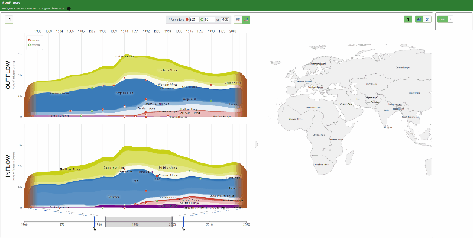

# EvoFlows: an Interactive Approach for Visualizing Spatial and Temporal Trends in Origin-Destination Data

## Resume
Origin-Destination (OD) datasets describe the movement of entities between different geographic locations over time, such as human migration, movement of animals or diseases, traffic movement, etc. Visualizing the spatio-temporal patterns underlying OD databases is a challenging task since it involves the study of flows between spatial locations (origins and destinations) in a temporal context. Resulting from a collaborative effort of computer scientists and social scientists, our new visualization tool, EvoFlows, combines and synchronizes two complementary views. The first one relies on a system for visualizing time series data, MultiStream, and highlights the temporal dimension of OD data. It depicts inflows and outflows as aggregated stacked time series. Relying on flow maps, the second one highlights the geographic dimension and magnitude of flows at a given time-stamp. Our approach allows the temporal and spatial exploration of the flows at different levels of detail through multiple interaction techniques, visual components, and synchronized animations. The practical usability is illustrated by analyzing data on refugee migration over a period of 59 years.

## Keywords
Visualization tool, Origin-Destination data, User interfaces

## Programming language
Javascript JS

## Datasets available
* Origin-Destination data:
	- 1960 - 2018 global refugee movements.

## Getting the code
The code is hosted at [Github](https://github.com/erickedu85/evoflows "Github")

Get the last version of this approach with:

	$ git clone https://github.com/erickedu85/evoflows
	$ cd evoflows
	
## Using
* Copy the files from the git repository to your web server (e.g. [HTTP Apache Server](https://httpd.apache.org/ "HTTP Apache Server"))
* Go to the web page: https://your-web-server/evoflows

## Licence
[Attribution-NonCommercial-ShareAlike 4.0 International](https://creativecommons.org/licenses/by-nc-sa/4.0/ "Attribution-NonCommercial-ShareAlike 4.0 International")